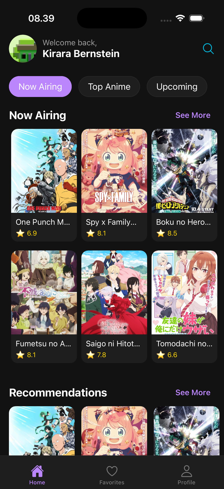

# AnimeExplorer 🌸

A beautiful and feature-rich React Native anime discovery app with modern UI, dark/light theme support, and comprehensive anime information powered by Jikan API.


## ✨ Features

### 🎨 **Modern UI/UX**
- **Dark/Light Theme Support** - Automatic theme switching with system preference
- **Responsive Design** - Optimized for both mobile platforms
- **Smooth Animations** - Fluid transitions and micro-interactions
- **Material Design** - Consistent design language throughout

### 🔐 **Authentication**
- **Firebase Authentication** - Secure login/signup with email/password
- **Google Sign-in** - One-tap authentication
- **Persistent Sessions** - Stay logged in across app restarts

### 🎯 **Anime Discovery**
- **Rich Anime Database** - Powered by Jikan API (MyAnimeList)
- **Advanced Search** - Find anime by title with real-time results
- **Category Browsing** - Now Airing, Top Anime, Upcoming releases
- **Detailed Information** - Comprehensive anime details, ratings, genres

### ❤️ **Favorites System**
- **Save Favorites** - Add/remove anime to personal favorites
- **Visual Indicators** - Heart icons show favorite status across all screens
- **Cloud Sync** - Favorites synced across devices via Firebase
- **Offline Access** - View favorites without internet connection

### 🔍 **Search & Navigation**
- **Global Search** - Search anime from any screen
- **Infinite Scroll** - Load more results seamlessly
- **Bottom Tab Navigation** - Easy navigation between sections
- **Deep Linking** - Direct links to specific anime

### 📱 **Platform Support**
- **iOS & Android** - Native performance on both platforms
- **Cross-platform** - Single codebase for multiple platforms
- **Optimized Builds** - Platform-specific optimizations

## 📸 Screenshots

### Authentication Flow
| Login | Register |
|-------|----------|
|  |  |

### Main App Experience
| Home Screen | Search Modal |
|-------------|--------------|
|  |  |

| Anime Detail | Category List |
|--------------|---------------|
|  |  |

| Favorites | Profile |
|-----------|---------|
|  |  |

## 🚀 Getting Started

### Prerequisites

- **Node.js** >= 18.0.0
- **npm** or **yarn**
- **React Native CLI**
- **Android Studio** (for Android development)
- **Xcode** (for iOS development)

### Installation

1. **Clone the repository**
   ```bash
   git clone https://github.com/your-username/anime-explorer.git
   cd anime-explorer
   ```

2. **Install dependencies**
   ```bash
   npm install
   # or
   yarn install
   ```

3. **Install iOS dependencies** (iOS only)
   ```bash
   cd ios && bundle install && bundle exec pod install
   ```

4. **Environment Setup**
   ```bash
   cp .env.example .env
   # Edit .env with your Firebase configuration
   ```

5. **Firebase Configuration**
   - Create a Firebase project at [Firebase Console](https://console.firebase.google.com/)
   - Enable Authentication and Firestore
   - Add your Firebase config to `.env`

### Running the App

#### Android
```bash
npm run android
# or
yarn android
```

#### iOS
```bash
npm run ios
# or
yarn ios
```

#### Metro Bundler
```bash
npm start
# or
yarn start
```

## 🏗️ Architecture

### Tech Stack

- **Framework**: React Native 0.82.0
- **Language**: TypeScript 5.8.3
- **State Management**: Zustand 5.0.8
- **Navigation**: React Navigation 6.x
- **Authentication**: Firebase Auth
- **Database**: Firebase Firestore
- **API**: Jikan API (MyAnimeList)
- **Icons**: Ionicons via @react-native-vector-icons
- **Styling**: StyleSheet with Theme Context

### Project Structure

```
src/
├── components/          # Reusable UI components
│   ├── shared/         # Shared components (ErrorBoundary)
│   └── SearchModal.tsx # Global search modal
├── screens/            # Screen components
│   ├── auth/          # Authentication screens
│   ├── home/          # Home screen with components
│   ├── detail/        # Anime detail screen
│   ├── category/      # Category list screen
│   ├── favorites/     # Favorites screen
│   └── profile/       # User profile screen
├── navigation/         # Navigation configuration
├── services/           # API services and utilities
│   ├── api/           # Base API configuration
│   └── favorites_service.ts # Firebase favorites
├── store/             # State management (Zustand)
├── theme/             # Theme configuration
├── types/             # TypeScript type definitions
├── utils/             # Utility functions
└── constants/         # App constants
```

### Key Components

#### Theme System
- **ThemeContext**: React Context for theme management
- **Theme Persistence**: Automatic theme saving to AsyncStorage
- **Dynamic Theming**: Real-time theme switching

#### State Management
- **Auth Store**: User authentication state
- **Favorites Store**: Anime favorites with Firebase sync
- **Theme Store**: Theme preferences persistence

#### API Layer
- **Jikan Service**: MyAnimeList API integration
- **Custom Hooks**: `useApi` for consistent API calls
- **Error Handling**: Comprehensive error boundaries

## 🔧 Configuration

### Environment Variables (.env)

```env
# Cloudinary Configuration (for image uploads)
CLOUDINARY_CLOUD_NAME=your_cloud_name
CLOUDINARY_API_KEY=your_api_key
CLOUDINARY_API_SECRET=your_api_secret
CLOUDINARY_BASE_FOLDER=anime-explorer-app

# API Configuration (optional - defaults to Jikan API)
JIKAN_BASE_URL=https://api.jikan.moe/v4
```

### Cloudinary Setup

1. **Create Cloudinary Account** at [Cloudinary](https://cloudinary.com/)
2. **Get your credentials** from Dashboard
3. **Update .env** with your Cloudinary configuration
4. **Configure upload presets** for image optimization

## 📱 Features in Detail

### 🎨 Theme System
- **Automatic Theme Detection**: Follows system dark/light mode
- **Manual Theme Toggle**: Override system preference
- **Persistent Settings**: Theme choice saved across sessions
- **Smooth Transitions**: Animated theme switching

### 🔍 Search Functionality
- **Real-time Search**: Instant results as you type
- **Infinite Pagination**: Load more results on scroll
- **Rich Results**: Anime posters, titles, ratings
- **Quick Navigation**: Tap to view anime details

### ❤️ Favorites Management
- **One-tap Favorite**: Heart button on all anime cards
- **Visual Feedback**: Red heart indicates favorited anime
- **Cloud Synchronization**: Favorites sync across devices
- **Offline Viewing**: Access favorites without internet

### 📊 Anime Information
- **Comprehensive Details**: Title, synopsis, ratings, genres
- **Visual Media**: High-quality anime posters
- **External Links**: Direct links to MyAnimeList
- **Trailer Support**: Watch anime trailers (when available)

## 🧪 Testing

```bash
# Run tests
npm test

# Run tests with coverage
npm run test:coverage

# Run linting
npm run lint

# Type checking
npm run type-check
```

## 📦 Build & Deployment

### Android APK
```bash
cd android
./gradlew assembleRelease
```

### iOS Build
```bash
cd ios
xcodebuild -workspace AnimeExplorer.xcworkspace -scheme AnimeExplorer -configuration Release
```

## 🤝 Contributing

1. Fork the repository
2. Create your feature branch (`git checkout -b feature/amazing-feature`)
3. Commit your changes (`git commit -m 'Add some amazing feature'`)
4. Push to the branch (`git push origin feature/amazing-feature`)
5. Open a Pull Request

## 📄 License

This project is licensed under the MIT License - see the [LICENSE](LICENSE) file for details.

## 🙏 Acknowledgments

- **Jikan API** - MyAnimeList API wrapper
- **React Native Community** - Amazing React Native ecosystem
- **Firebase** - Backend services and authentication
- **React Navigation** - Navigation library
- **Ionicons** - Beautiful icon set

## 📞 Support

For support, email kirara@example.com or join our Discord community.

---

**Made with ❤️ by AnimeExplorer Team**
